1、名言警句
2、影响(三个事关)
政治民生经济:1、事关人民群众的根本利益、事关政府治理能力和治理水平的提升、事关社会主义现代化建设事业的成败/是增进人民福祉/满足人民美好生活需要的必由之路、是建设服务型政府的必经之法、是实现中华民族伟大复兴的必然选择。

乡村振兴:关系到社会主义新农村建设、关系到农业农村现代化、关系到巩固拓展脱贫攻坚成果同乡村振兴的有效衔接;是深化农村改革、增强农村发展活力的重大举措，是实现农业农村现代化的核心保证，是广袤乡村大地能否扎稳振兴之“根”的关键之举/实施乡村振兴战略，是推动高质量发展的必然途径，是强化生态文明建设的关键举措，是解决新时代矛盾的有效抓手，是健全现代社会治理格局的固本之策，是实现伟大复兴的必然要求。

行政执法:是打造政治文明的客观要求，是促进经济繁荣的必要条件，是保障社会和谐的重要举措，是建设社会主义现代化强国的重要内容/是实现国家治理现代化的重要保障，是适应经济新常态的现实需要，是保障人民幸福安康的内在要求/是保障群众利益的客观要求，是维护社会稳定的必要条件，是推进法治政府建设的核心要义;全面推进依法治国，建设社会主义法治国家，是社会发展的必然产物，是社会主义社会的本质要求，也是总结历史沉痛教训后的明智决策;是新时期培育和践行社会主义核心价值观的重要保证，也是中国共产党领导全国人民把我国建成富强、民主、文明、和谐美丽的社会主义现代化国家，实现中华民族伟大复兴中国梦的应有之义。/全面依法治国是国家治理的一场深刻革命，关系党执政兴国，关系人民幸福安康，关系党和国家长治久安。

---

1、名言警句
2、影响(三个事关)
文化:文化引领时代风尚、刻写民族希望、诏示国家未来/文化是时代前进的号角、文化能代表一个时代的风貌、文化能引领一个时代的风气/文化是一个国家一个民族的灵魂、是华夏民族积淀数千年的瑰宝，是中华民族最基本的基因/

环境:事关"既要金山银山，也要绿水青山“到"绿水青山就是金山银山”的观念转变，事关转变经济发展方式的战略导向事关实现可持续发展实践/既是引领经济新常态的重要保障，又是体现大国担当的现实需要，更是改善民生福祉的内在要求/既是解决生态矛盾的客观要求、又是保障人民美好生活前景的必要条件、也是实现伟大复兴中国梦的核心要义。

经济:是经济健康发展的必行之法，更是增进人民福祉的必经之路，是实现第二个一百年奋斗目标的必然要求/是引领发展的强大动力，是建设现代化经济体系的战略支撑，是实现高质量发展的必经之路。

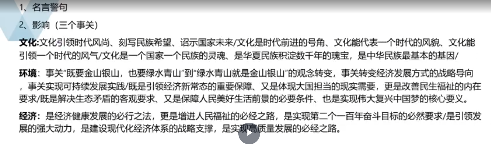

科技:事关突破“卡脖子”技术的战略主动权，事关培育新质生产力的发展新动能，事关抢占未来产业制高点的国家竞争力/事关打破外部技术垄断的战略突围，事关拿握核心专利布局的竞争主动，事关构建自主创新体系的安全根基/事关传统制造业“智改数转”的动能激活，事关新兴产业集群的生态构建，事关产业链价值链的高端攀升/事关全球科技话语权的主动争夺，事关未来产业规则的制定权掌控，事关创新型国家建设的战略支撑/事关要素驱动向创新驱动的根本转变，事关人口红利向人才红利的价值跃升，事关还度规模向质量效益的发展转墅。

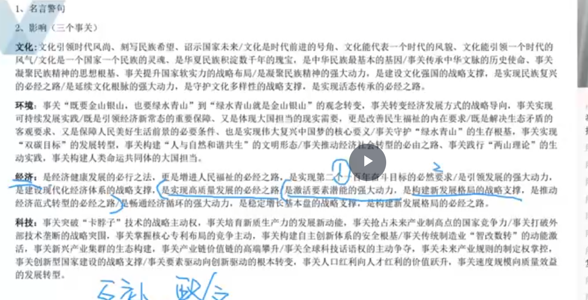

---

3、成绩+问题:近年来，各地区、各部门加快xx建设，x能力和水平有了较大提高/近年来，以xxx同志为核心的党中央深刻认识新时代所面临的新趋势新机遇新矛盾新挑战，领导人民持续探索，不断推进xx建设，成功走出了一条中国特色社会主义xx道路，成为我们党百年奋斗重大成就和光辉历史的重要组成部分，但xxx问题仍时有发生
(环境:但我们也面临资源约束趋紧、环境承受力脆弱、生态系统退化)(法律:但我国政府还存在执法体制权责脱节、多头执法、选择性执法、执法不规范、不严格、不透明、不文明等现象)
(科技:尽管科技水平有所提升，但在部分重要领域、关键核心技术上仍然受制于人)
(然而，居民文化消费不足、公共服务惠而不实、文化精品匮乏等问题成为制约我国文化建设的拦路虎)

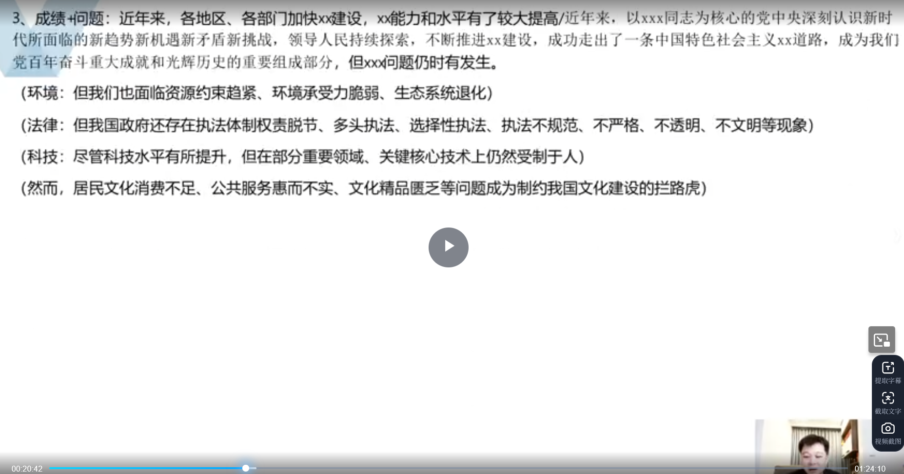

---

4、背景:百年初心历久弥坚，百年征程波澜壮阔。时代大潮中，xx的宏伟蓝图已经磅礴展开/
当今世界正处于百年未有之大变局，中华民族伟大复兴进入关键时期，我国发展面临前所未有的挑战/
百年变局交织世纪疫情，面对风高浪急的国际环境和艰巨繁重的国内改革发展稳定任务/
当前，世界之变、时代之变、历史之变正以前所未有的方式展开/
当前，国内环境深刻变化，世界格局动荡不安，我国面临着难得的历史机遇，也经历着一系列重大风险考验/
当前，国际环境波谲云诡，改革发展稳定任务依然艰巨繁重。但机遇与挑战并存，困难与希望同在。
当前，经济快速发展，社会急剧转型。
当前，我国经济社会发展进入新阶段，新时代新征程上，解决xx问题具有强烈的现实紧迫性。
当今世界，新一轮科技革命和产业变革突飞猛进，国际形势正经历复杂深刻的演变
当前和今后一个时期，我国发展仍然处于重要战略机遇期，但机遇和挑战都有新的发展变化。当今世界正经历百年未有之大变局，新一轮科技革命和产业变革深入发展，国际力量对比深刻调整，和平与发展仍然是时代主题，人类命运共同体理念深入人心。同时，国际环境日趋复杂，不稳定性不确定性明显增加，新冠肺炎疫情影响广泛深远，世界经济陷入低迷期，经济全球化遭遇逆流，全球能源供需版图深刻变革，国际经济政治格局复杂多变，世界进入动荡变革期，单边主义、保护主义、权主义对世界和平与发展构成威胁。

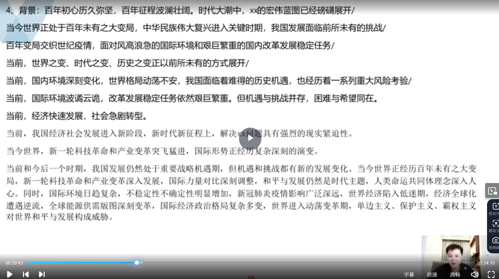

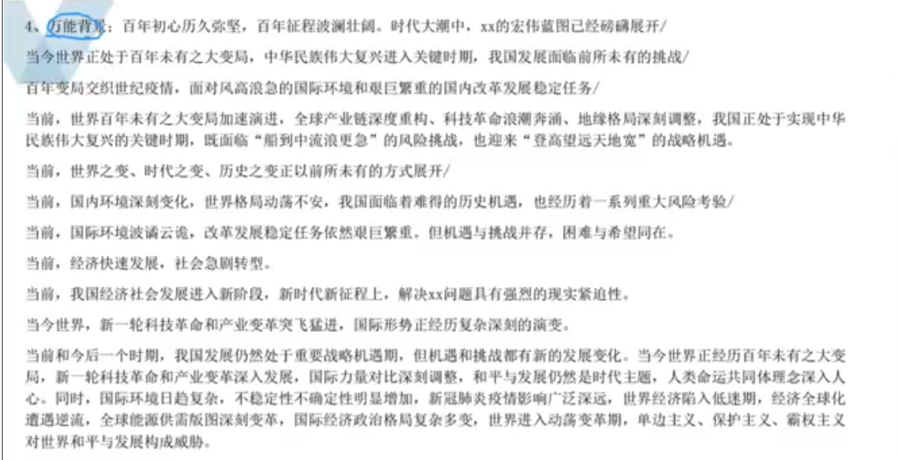

---

过渡句句:成功类
·冰心说过:成功的花，人们只惊羡她现时的明艳!然而当初她的芽儿，浸透了奋斗的泪泉，洒遍了牺牲的血雨。
历尽天华成此景，人间万事出艰辛。
时间不等人!历史不等人!时间属于奋进者!历史属于奋进者!为了实现中华民族伟大复兴的中国梦，我们必须同时间赛跑、同历史并进。
“艰难方显勇毅，磨砺始得玉成。”“惟其艰难，才更显勇毅;惟其独行，才弥足珍贵。
脚踏人间正道，何惧世事沧桑。不驰于空想，不鹜于虚声 茫茫九脉流中国，纵横当有凌云笔。
志之所趋，无远弗界，穷山距海，不能限也 古人云”图垂成之功者，如挽上滩之舟，莫少停一棹。
正入万山圈子里，一山放过一山拦。--杨万里 征程万里风正劲，重任干钧再出发。
上坡路难走，力行则将至;顶风船难开，笃志则必达。风雨多经志弥坚，关山初度路尤长。
物转星移几度秋，雄心壮志两峥嵘。志不求易者成，事不避难者进 事者，生于虑，成于务，失与傲
北宋苏轼《思治论》有云:犯其至难而图其至远 浩渺行无极，杨帆但信风
须与懈怠，或将停滞不前;半点停顿，或将前功尽弃。平两岸阔，风正一帆悬
沉舟侧畔千帆过，病树前头万木春 扬帆起航正当时，砥砺奋进谱华章
纵使海浪翻滚，亦能逆身前行;纵然迷雾缭绕，亦现非凡曙光。路虽远，行则将至;事难成，做必成
不畏山高路远的跋涉者，山川回馈以最奇绝的秀色 干淘万漉虽辛苦，吹尽黄沙始到金

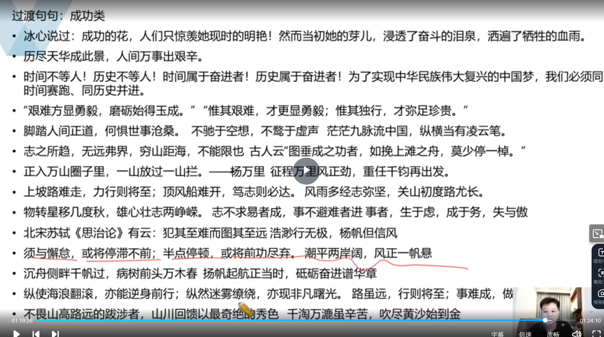

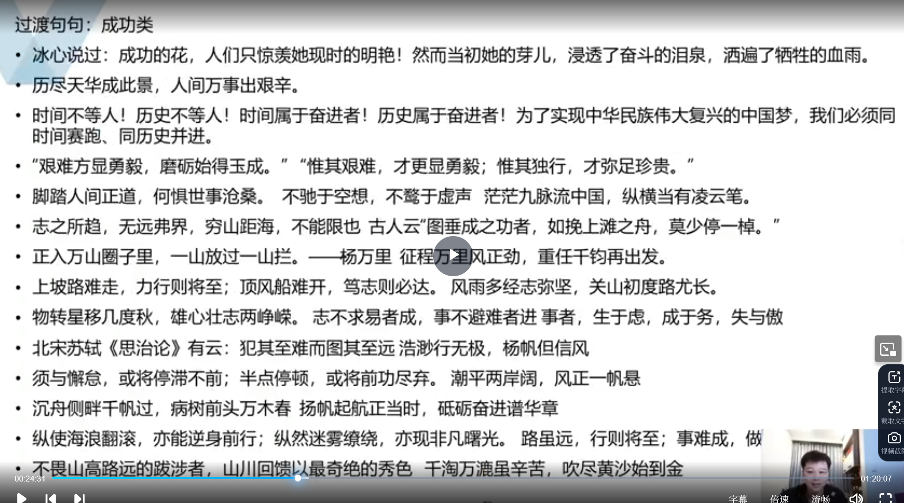

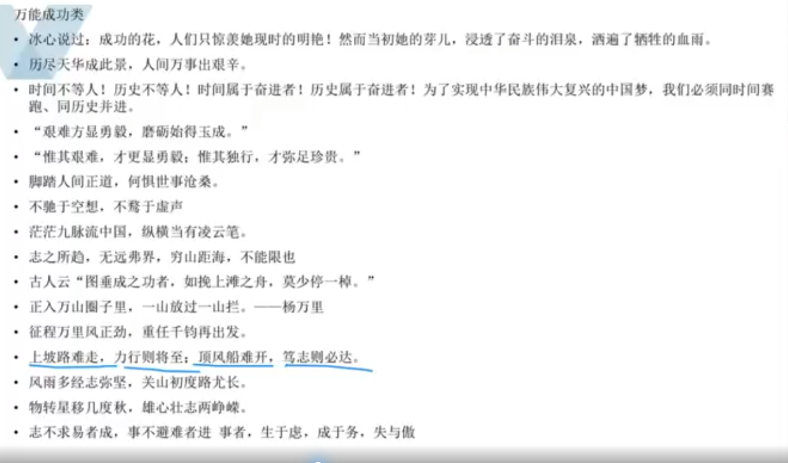

---

影响
当前，我国经济社会发展进入新阶段，新时代新征程上，解决xx问题具有强烈的现实紧迫性。
站在第二个一百年奋斗目标的历史节点上，面向“十四五”、迈步新征程，解决好xx问题是夺取全面建设社会主义现代化国家新胜利的关键。
·Xx问题关系到群众的切身利益，且并非一朝一夕之功，任重而道远，
·站在新的历史起点上，面对xx问题，我们不能有任何喘口气、歇歇脚的念头，必须发扬迎难而上的精神，披荆斩棘，闯关夺隘，过了一山再一峰，跨过一沟再越一壑。
有效解决xx问题，是经济健康发展的必行之法，也是增进人民福祉的必经之路，更是夺取全面建设社会主义现代化国家新胜利的关键。

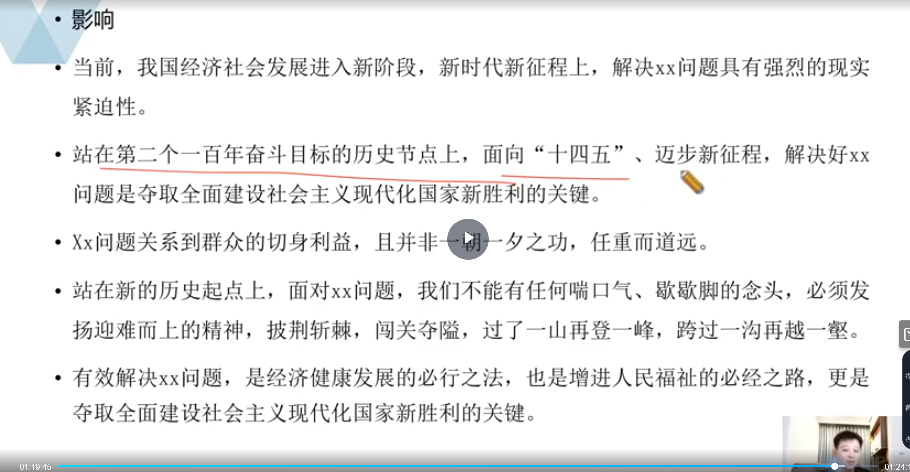

---

号召
为此，我们要以“领跑者”的责任、“弄潮儿”的闯劲、“施工队”的作为，奋力拼搏，接续奋斗，xx论点，为实现第二个百年奋斗目标、实现中华民族伟大复兴的中国梦不断奋斗。
为此，我们要坚定信念、满怀信心，保持“风雨无阻向前进”的奋进姿态，激扬“越是艰险越向前”的精气神，葆有“踏平坎坷成大道、斗罢艰险又出发”的顽强意志，xx论点，方能书写更新完美的时代篇章。
为此，我们必须把xx摆在更加重要的位置，坚心决心，以永不懈怠的精神状态，一往无前的奋斗姿态，真抓实干、埋头苦干、向着实现第二个百年奋斗目标奋勇前进!
时间不等人，历史不等人。肩负新使命，我们惟有燃旺梦想的火炬，凝聚奋进的力量，xx论点，为实现美好蓝图顽强拼搏、加劲冲刺。
滚石上山、爬坡过坎，只有蓄积“千磨万击还坚劲”的韧性，砥砺“越是艰险越向前”的品格，攻坚克难、善战能胜，才能xx论点，为实现中华民族伟大复兴的中国梦不断凝聚正能量

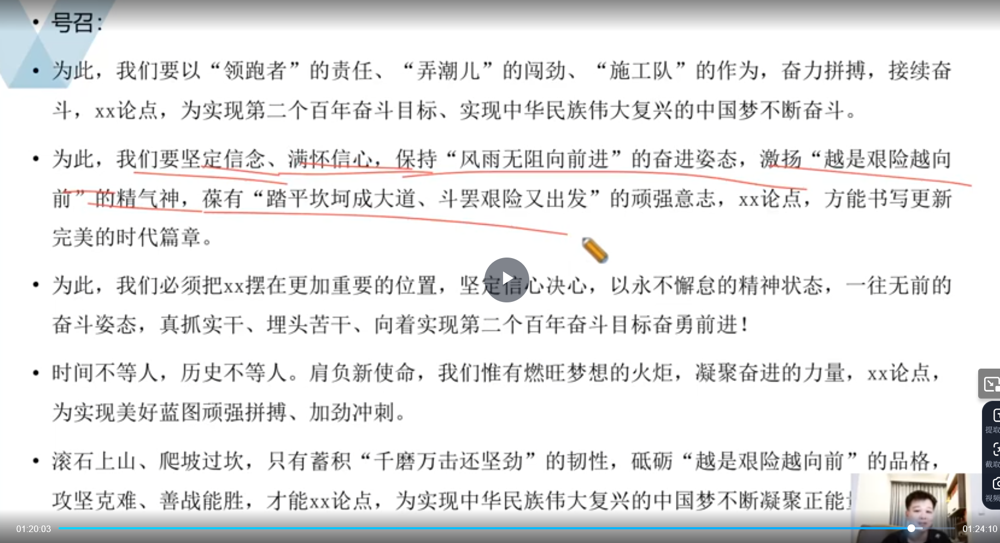

---

背景
科技:当今世界，新一轮科技革命和产业变革突飞猛进，国际形势正经历深刻复杂的演变。在激烈的国际竞争中，我们要开辟发展新领域新赛道、塑造发展新动能新优势，从根本上说，还是要依靠科技创新-科技立则民族立，科技强则国家强。经济:当前，我国已经由高速增长阶段转向高质量发展阶段，经济长期向好，物质基础丰富，人力资源丰富，市场空间广阔，发展韧性强劲。
文化:文化兴则国运兴，文化强则民族强。当前，我国公共文化服务水平不断提高，文化事业和文化产业繁荣发展./xx指出，全面建设社会主义现代化国家，必须坚持中国特色社会主义文化发展道路，增强文化自信，围绕举旗帜、聚民心、育新人、兴文化、展形象建设社会主义文化强国，发展面向现代化、面向世界、面向未来的，民族的科学的大众的社会主义文化，激发全民族文化创新创造活力，增强实现中华民族伟大复兴的精神力量。/改革开放几十年，随着中国国力的增强、国际地位的提升，中国传统文化的挖掘和传播也迎来了春天/党的十八大以来，我国大力传承和弘扬中华民族优秀传统文化，进一步促进传统文化与现代文明融合，推动一系列文明风尚建设，不断荡涤社会陋习和不良风气。步人新时代，生富足、法治进步，我们的精神文明同样”水涨船高”。
民生:党的二十大报告将“坚持以人民为中心的发展思想“明确为前进道路上必须牢牢把握的五条重大原则之一，提出"维护人民根本利益，增进民生福祉，不断实现发展为了人民、发展依靠人民、发展成果由人民共享，让现代化建设成果更多更公平惠及全体人民/党的十九届六中全会指出:“党的根基在人民、血脉在人民、力量在人民，人民是党执政兴国的最大底气。民心是最大的政治，正义是最强的力量。党的最大政治优势是密切联系群众，党执政后的最大危险是脱离群众。"/以xx为核心的党中央始终坚持以人民心的发展思想。习近平总书记指出:“我的执政理念，概括起来说就是:为人民服务，担当起该担当的责任。"/在二十大报告中，近平总书记着重指出，必须坚持在发展中保障和改善民生，鼓励共同奋斗创造美好生活，不断实现人民对美好生活的向往。/党的山十大报告指出，完善社会治理体系，健全共建共治共享的社会治理制度，提升社会治理效能。社会治理现代化是国家治理体系的组成部分，是中国式现代化在社会领域的具体体现，是国家现代化建设的重要组成部分。
步态：绿色，是生命的颜色，更是当代中国发展最鲜明的底色。《中华人民共和国国民经济和社会发展第十四个

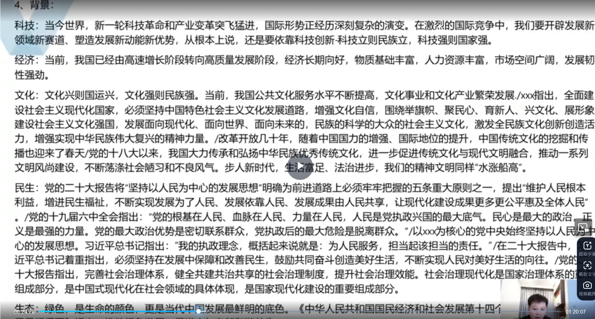

---

4、背景!
法治:党的十七届四中全会以来，全面依法治国深入推进，法制观念深入人心，依法治国，全民守法已经成为社会共识。/“立善法于天下，则天下治;立善法于一国，则一国治。"以习近平同志为核心的党中央对全面依法治国高度重视，从关系党和国家长治久安的战略高度来定位法治、布局法治、厉行法治，把全面依法治国放在党和国家事业发展全局中来谋划，来推进。
乡村振兴:没有几亿农民的富裕是不完全的富裕，没有农村的现代化是不完整的现代化，没有乡村的振兴是不完全的振兴/民族要复兴，乡村必振兴。Xxx党的二十大报告中指出，全面建设社会主义现代化国家，最艰巨最繁重的任务依然在农村/2020年，xx在中央农村工作会议上指出，脱贫攻坚取得胜利后，要全面推进乡村振兴，这是“三农“工作重心的历史性转移/党的二十大对全面推进乡村振兴作出了新部署，吹响了实现农业农村现代化的奋进号角，为做好当前及今后一个时期的"三农"工作提供了基本遵循。从打赢脱贫攻坚战到全面推进乡村振兴，新时代的中国正在描绘更加美好的时代画卷。/党的二十大报告强调，加快建设农业强国，扎实推动乡村产业、人才、文化、生态、组织振兴。

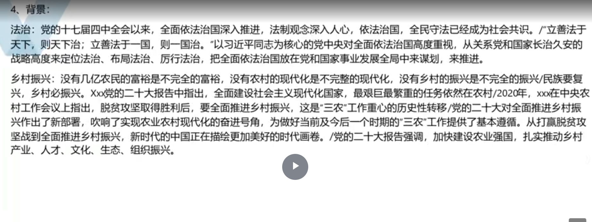

---

Xx分论点，既是推动经济社会又好又快发展的必经之法，也是改善民生，实现全面、协调可持续发展的必然选择，更是实现高质量发展的必由之路。
Xx分论点，既是贯彻新发展理念的重要举措、也是响应人民群众共识和呼声的应有之义更是关系我国经济社会发展全局的点睛之笔。
Xx分论点，默既ぎ旨猛立足新发展阶段的核心支撑，又是构建新发展格局的内在要求，更是统筹推进“五位一体”总体布局的根本保证。
我国近些年高度重视xxx工作，成绩有目共睹，然而也存在一定的问题:xx、xx、xx,此类现象不胜枚举，既不利于xx，也有不利于xx。
与此同时，我们也看到1事例(主体、对策、影响)+2事例(主体、对策、影响)+3事例(主体、对策继、影响)
因此，我们需要对策+影响(回扣分论点)

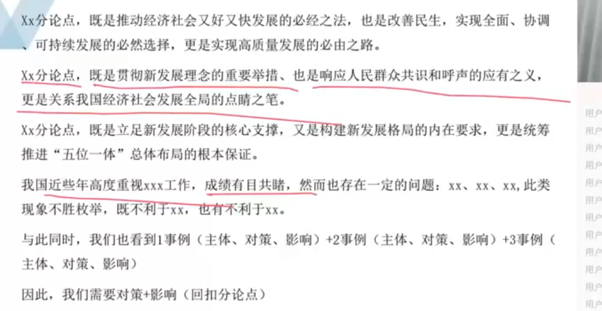

---

北宋苏轼《思治论》有云:犯其至难面图其至远
浩渺行无极，杨帆但信风
须与懈息，或将停滞不前:半点停顿，或将前功尽弃。
·湖平两岸阔，风正一帆悬
沉舟侧畔千帆过，病树前头万木春。
扬帆起航正当时，砥砺奋进谱华章
纵使海浪翻滚，亦能逆身前行;纵然迷雾缭绕，亦现非凡曙光。
”路虽远，行则将至:事难成，做则必成。
。不畏山高路远的跋涉者，山川回馈以最奇绝的秀色
千淘万漉星辛苦，吹尽黄沙始到金
·路漫漫其修远兮，吾将上下而求家
·天行健，君子以自强不息
长风破浪会有时，直挂云帆济沧海。
古之成大事者，不惟有超世之才，亦有坚忍不拔之志。
锲而会之，朽木不折;锲而不含，金石可镂

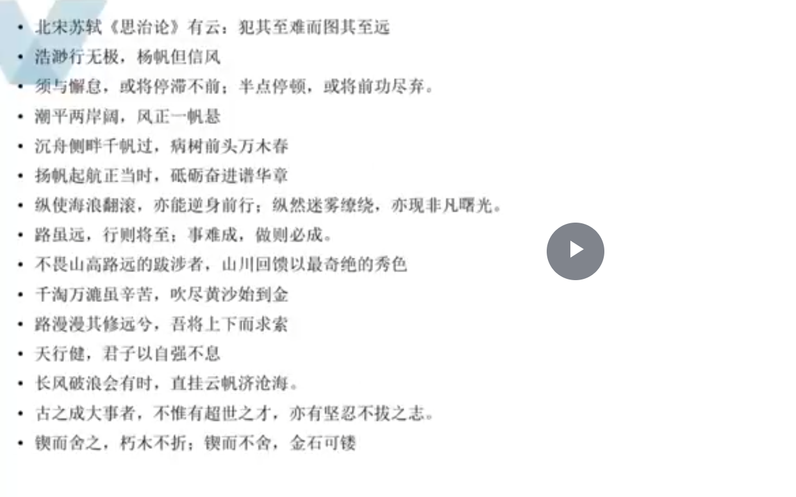

为者常成，行者常至
但愿苍生俱保暖，不辞辛苦出山林4志不强者智不达。
天下之事常成于困约，而败于奢靡
·绳锯木断，水滴石穿。
·精诚所加，金石为开。
坚志而勇为，谓之刚。刚，生人之德也。#
。日日行，不怕千万里:常常做，不怕千万事。

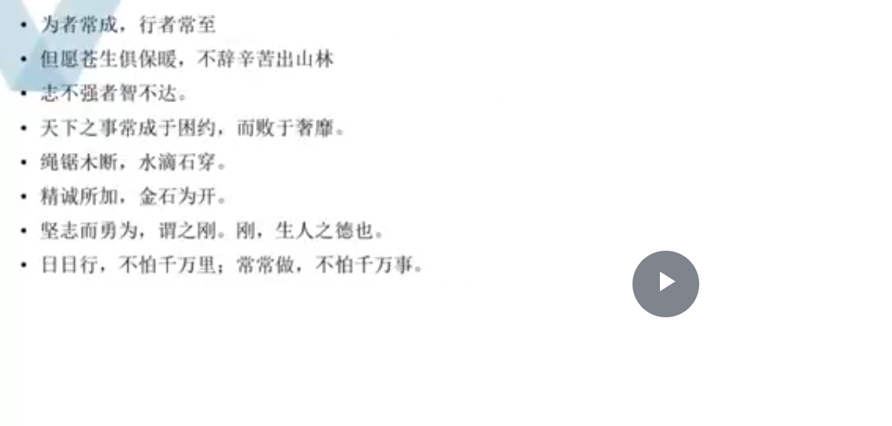

